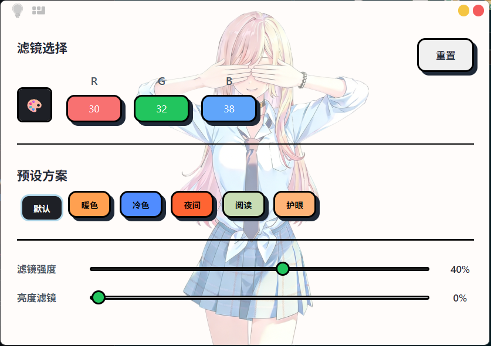
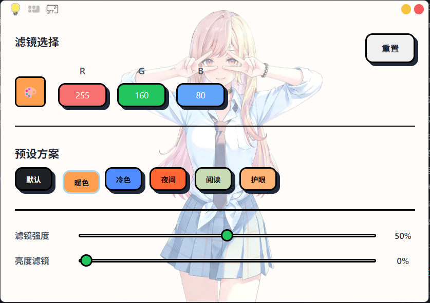

# 屏幕护眼工具

一款基于 Python + pywebview 开发的屏幕护眼工具，支持 RGB 颜色滤镜、亮度调节、预设方案和全局快捷键。

## 功能特性

- 🎨 **RGB 颜色滤镜** - 自定义红绿蓝三色值，调节屏幕色温
- 💡 **亮度滤镜** - 0-90 亮度调节范围，保护眼睛，当RGB只有30的时候亮度调节最大值为70
- 🔆 **滤镜强度** - 0-100 强度调节，找到最舒适的亮度
- 📦 **预设方案** - 内置多种预设（默认、暖色、冷色、夜间、阅读、护眼）
- ⌨️ **全局快捷键** - 无需聚焦窗口即可控制
- 🖥️ **系统托盘** - 后台运行，不占用任务栏
- 🪟 **窗口控制** - 支持最小化、关闭、拖拽移动

## 界面预览

程序主界面包含以下模块：
- 顶栏拖拽区域（可拖动窗口）
- 滤镜开关
- RGB 颜色输入
- 预设选择
- 亮度调节
- 快捷键设置




## 安装依赖

```bash
pip install -r requirements.txt
```

## 运行程序

```bash
python main.py
```

## 快捷键

| 功能 | 默认快捷键 |
|------|-----------|
| 增加滤镜强度 | Ctrl+Right |
| 减少滤镜强度 | Ctrl+Left |
| 增加亮度滤镜 | Alt+Right |
| 减少亮度滤镜 | Alt+Left |
| 下一个预设 | Ctrl+Up |
| 上一个预设 | Ctrl+Down |
| 切换滤镜开关 | Ctrl+O |
| 切换窗口显示 | Alt+S |
| 熄屏 | Ctrl+Shift+S |

## 目录结构

```
screen-filter/
├── main.py                     # 主程序入口
├── vue-web/
│   └── index.html              # 前端界面
├── config.json                 # 配置文件（自动生成）
├── default_config_backup.json  # 默认配置文件，重置时使用
├── requirements.txt            # Python 依赖
├── LICENSE                     # 开源协议
└── README.md                   # 使用说明
```

## 配置说明

配置文件 `config.json` 会在首次运行后自动生成，包含：
- `hotkeys`: 快捷键配置
- `presets`: 预设方案

## 系统要求

- Windows 10/11
- Python 3.10+
- 管理员权限（用于设置全局快捷键）

## 开源协议

本项目基于 GPL-3.0 开源协议发布。

【允许】
- 个人学习、研究使用
- 开源项目使用
- 自由修改和再分发

【禁止】
- 商业销售行为
- 商业产品捆绑
- 收费服务使用
- 闭源分发修改版本

详见 [LICENSE](LICENSE) 文件。

## 免责声明

本软件按"原样"提供，不提供任何明示或暗示的保证。
因使用本软件造成的任何损失，作者不承担任何责任。

## 问题反馈

如遇到问题或有任何建议，请提交 Issue。
